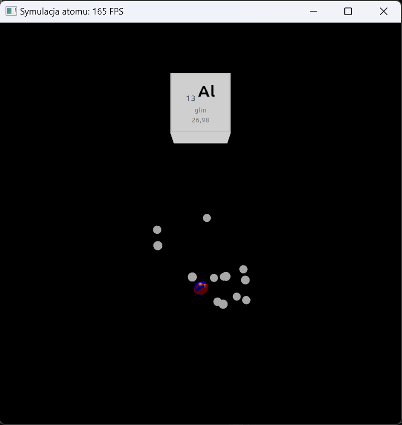

# AtomSimulation
## Preview

## Usage
```
git clone https://github.com/Dar3cz3Q/AtomSimulation.git
```
Then run ```Scripts/Setup-Windows.bat``` and open ```Atom Simulation.sln``` in Visual Studio 2022.
### Used keys
 - Mouse with left button pressed - looking around
 - ```W, S, A, D, Space, Ctrl``` - moving around
 - ```Shift``` - speeding up
 - ```Left arrow, right arrow``` - changing element to render
 - ```1, 2, 3, 4``` - changing filters (normal, reversed colors, grey scale, edge detection)
